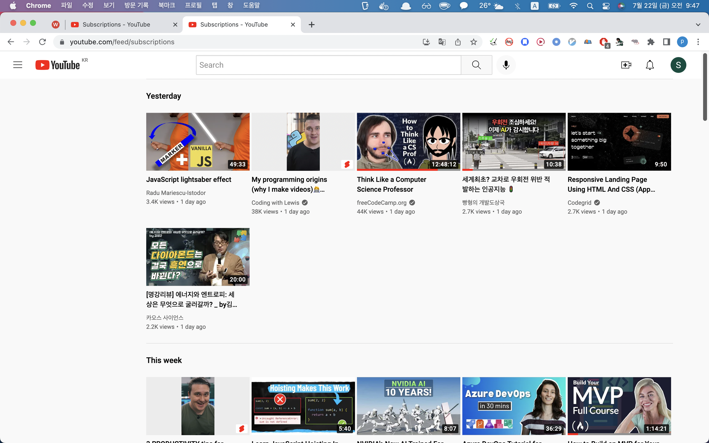
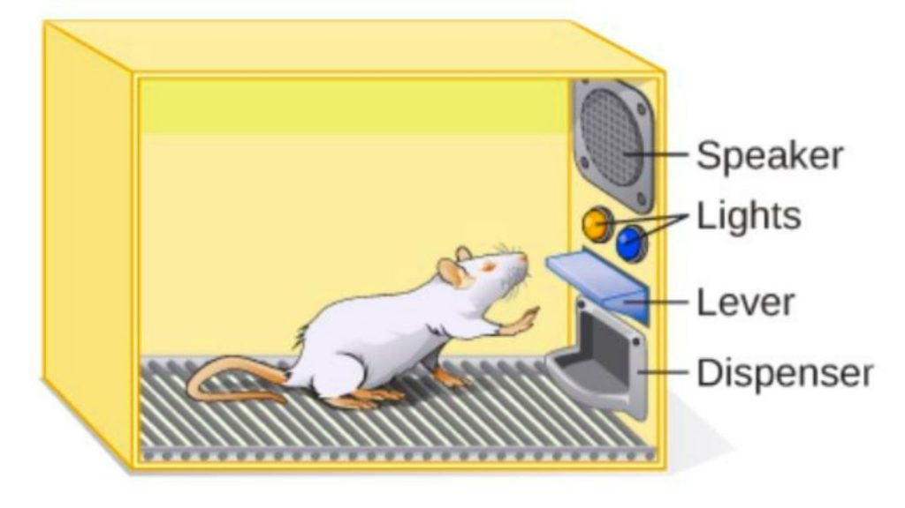
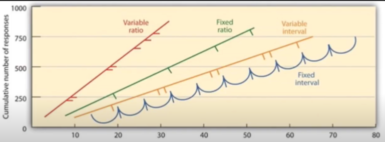

# What is this app?

시간을 정해놓으면,\
해당 시간 전까지 유튜브에 들어가도 오늘 추가된 구독채널영상이 안나온다.

# Why use this app?

매일 정해진 시간에 유튜브 보겠다라고 결심해도 작심삼일.\
youtube block 하는 앱 써봤는데, 금지하니까 오히려 더 보고싶어서 부작용남.

유튜브에 중독된 것 같다.\
왜 유튜브에 중독되었나.\
skinner box 실험에서 증명된 간헐강화 메커니즘 때문이다.

1. variable(랜덤 보상) vs fixed(고정 보상)
2. ratio(랜덤 타이밍) vs interval(고정 간격 타이밍)

현재 유튜브는 variable ratio(빨간 선) 이다.\
영상의 내용을 바꿀 순 없으므로, 랜덤 보상에서 고정보상으로는 못바꾸나,\
유튜브 영상이 나오는 주기를 랜덤에서 고정시간으로 바꾸면,\
빨간 선에서 녹색선으로 기울기가 상당히 완만헤진다.\
유튜브에 덜 중독되지 않을까?

# How to install and use?
1. git clone https://github.com/Doohwancho/win-skinner-box.js.git
2. 크롬 익스텐션 매니저에서 추가
3. 크롬 메뉴바에 쥐 아이콘 클릭 후, 원하는 시간 설정
